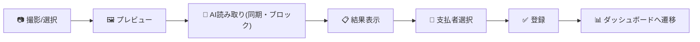
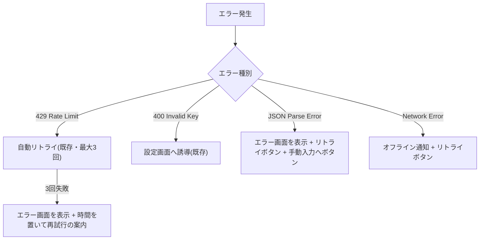
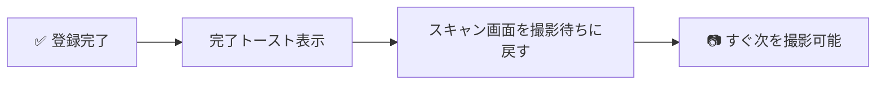
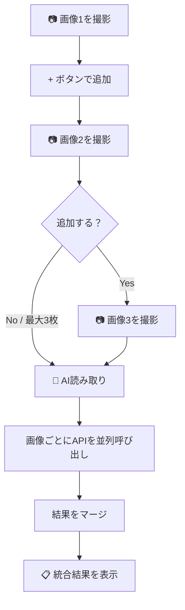
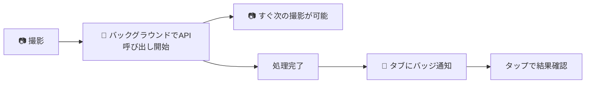

# 📸 レシートスキャン機能 改善設計書

## 現状の処理フロー



> **⚠️ WARNING**
> 現在は **1枚撮影 → 結果確認 → 登録 → 画面遷移** の直線フローで、連続撮影や修正の余地がない

---

## 課題一覧と優先度

| # | 課題 | 重さ | 優先度 | 状態 |
|---|------|------|--------|------|
| 1 | [支払者の入力タイミング](#1-支払者の入力タイミング) | 🟢 軽い | **P0** | ✅ 完了 |
| 2 | [エラーハンドリング改善](#2-エラーハンドリング改善) | 🟢 軽い | **P0** | ✅ 完了 |
| 3 | [登録後の個別修正](#3-登録後の個別修正) | 🟡 中程度 | **P1** | ✅ 完了 |
| 4 | [連続撮影フロー](#4-連続撮影フロー) | 🟢 軽い | **P1** | ✅ 完了 |
| 5 | [長いレシート対応（複数枚合成）](#5-長いレシート対応複数枚合成) | 🔴 重い | **P2** | 未着手 |
| 6 | [読み取り速度改善（非同期化）](#6-読み取り速度改善非同期化) | 🔴 重い | **P2** | 未着手 |
| 7 | [重複登録チェック](#7-重複登録チェック) | 🟢 軽い | **P1** | ✅ 完了 |

---

## 1. 支払者の入力タイミング

### 現状の問題
- 「誰の買い物？」が **結果表示後** にしか出てこない（index.html L188-203）
- デフォルトが `manabu` 固定（app.js L49）で、mako が撮影した場合に変更を忘れやすい

### 設計方針
- 「誰の買い物？」を **撮影前（scanInputArea 内）** に移動する
- 結果表示セクションの person-toggle は **撤去**（二重表示を防ぐ）
- `state.scanPerson` は撮影前に確定し、登録までそのまま使う

### 変更箇所
| ファイル | 箇所 | 内容 |
|----------|------|------|
| index.html | `scanInputArea` 内 | person-toggle を撮影ボタンの上に追加 |
| index.html | `scanResults` 内 | `result-person-section` を削除 |
| app.js | イベントバインド | 変更不要（`[data-scan-person]` セレクタはそのまま機能） |

### 工数見積り
**30分以内** — HTML の要素移動のみ

---

## 2. エラーハンドリング改善

### 現状の問題
- エラー時に Toast だけ表示して、プレビュー画面に戻る
- JSON パースエラー時のフォールバックがない
- ユーザーに **何をすべきか** のガイダンスがない

### 設計方針



- Toast だけでなく、**スキャンエリア内にエラー状態の UI** を表示する
- エラー画面には以下のボタンを配置：
  - 🔄 もう一度試す（同じ画像で再実行）
  - 📝 手動で入力する（追加タブへ遷移）
  - 📷 別のレシートを撮る（リセット）
- `fetch` の `catch` で **ネットワークエラー** も捕捉して専用メッセージを出す

### 実装済み（部分）
エラーメッセージのわかりやすい日本語化は **実装済み**（app.js `executeOCR` 内）。
エラー専用UIパネルの追加は未実装。

### 変更箇所（残作業）
| ファイル | 箇所 | 内容 |
|----------|------|------|
| index.html | `scanResults` 付近 | エラー表示用の `scanError` div 追加 |
| app.js | `executeOCR` の catch | エラー種別に応じた UI 表示関数を呼ぶ |
| style.css | — | エラー状態のスタイル追加 |

### 工数見積り
**1時間** （メッセージ改善済みのため残りはUI部分のみ）

---

## 3. 登録後の個別修正

### 現状の問題
- 登録後は **履歴タブで削除のみ可能**（app.js `requestDelete` / `confirmDelete`）
- 金額・カテゴリ・メモ・日付・担当者の編集ができない
- レシート読み取り結果を登録後に「あ、カテゴリ違った」と気づいても修正できない

### 設計方針

#### 案A: インライン編集（推奨）
- 履歴タブの各取引アイテムをタップすると **編集モーダル** が開く
- 追加タブと同じ UI（金額・カテゴリ・日付・メモ・担当者）をモーダル内に表示
- 「保存」で `state.entries` を更新 → `saveEntries()` で永続化

```
┌─────────────────────────────┐
│  📝 記録を編集               │
│                              │
│  金額:   ¥[ 1,280      ]    │
│  カテゴリ: [🍽️ 食費 ▼]      │
│  担当者:  [manabu][mako][共通]│
│  日付:   [ 2026-05-11  ]    │
│  メモ:   [ スーパーでの買い物 ]│
│                              │
│  [ キャンセル ]  [ 保存する ] │
└─────────────────────────────┘
```

#### 案B: 詳細画面遷移
→ GitHub Pages の SPA 構成では複雑すぎるため **不採用**

### 変更箇所
| ファイル | 箇所 | 内容 |
|----------|------|------|
| index.html | modal 追加 | 編集モーダル HTML |
| app.js | 新規関数 | `openEditModal(id)`, `handleEditSave()` |
| app.js | `createTransactionHTML` | タップで `openEditModal` を呼ぶように変更 |
| style.css | — | 編集モーダルのスタイル |

### 工数見積り
**2〜3時間**

---

## 4. 連続撮影フロー

### 現状の問題
- 登録完了後に `switchTab('dashboard')` でダッシュボードに遷移してしまう
- 「レジ袋3枚分のレシート」のように連続で登録したい場合、毎回タブを切り替える必要がある

### 設計方針

#### 登録後のフローを変更


- `saveAllScannedItems()` / `saveTotalOnly()` の最後で、`switchTab('dashboard')` の代わりに `resetScan()` のみ呼ぶ
- 「ダッシュボードを見る」ボタンを Toast またはスキャン画面内に小さく表示
- 完了メッセージに「続けてスキャンできます」を明示

### 変更箇所
| ファイル | 箇所 | 内容 |
|----------|------|------|
| app.js | `saveAllScannedItems()` | `switchTab('dashboard')` → `resetScan()` |
| app.js | `saveTotalOnly()` | 同上 |
| app.js | Toast メッセージ | 「✅ 3件登録しました。続けて撮影できます」に変更 |

### 工数見積り
**30分以内** — 数行の変更のみ

---

## 5. 長いレシート対応（複数枚合成）

### 現状の問題
- 画像入力が **1枚限定**（`state.scanImageBase64` がスカラー値）
- 長いレシート（コンビニの長いレシートなど）を1枚で撮れない場合に対応できない

### 設計方針

#### 方式: 複数画像を個別にAPIへ送信 → 結果をマージ



**マージルール:**
- 店名は1枚目を採用
- items は全画像分を結合
- total は最終画像（レシート下部）の値を優先

#### 状態管理の変更
```javascript
// Before
state.scanImageBase64 = "data:image/jpeg;base64,...";

// After
state.scanImages = [
    { base64: "data:image/jpeg;base64,...", status: 'ready' },
    { base64: "data:image/jpeg;base64,...", status: 'ready' },
];
```

#### UIの変更
- プレビュー画面にサムネイル一覧 + 「📷 もう1枚追加」ボタン（最大3枚）
- 各サムネイルに ❌ 削除ボタン

#### マージロジック
```javascript
function mergeOCRResults(results) {
    return {
        store_name: results[0].store_name,
        store_branch: results[0].store_branch,
        date: results[0].date,
        time: results[0].time,
        items: results.flatMap(r => r.items || []),
        // total は最後の画像（レシート下部）を優先
        total: results[results.length - 1].total
            || results.reduce((sum, r) => sum + (r.total || 0), 0),
        payment_method: results.find(r => r.payment_method)?.payment_method,
    };
}
```

#### プロンプトの調整
- 2枚目以降は「これは前のレシートの続きです。品目と金額のみ読み取ってください」と指示を変えて token 節約

### 変更箇所
| ファイル | 箇所 | 内容 |
|----------|------|------|
| app.js | state | `scanImageBase64` → `scanImages[]` に変更 |
| app.js | `handleImageSelect` | 配列への push + サムネイル追加 |
| app.js | `executeOCR` | 複数画像の並列呼び出し + `mergeOCRResults` |
| index.html | `scanPreview` | サムネイル一覧 + 追加ボタン UI |
| style.css | — | サムネイルグリッド + 追加ボタンのスタイル |

### 工数見積り
**3〜5時間** — API呼び出しのリファクタ + マージロジック + UI変更

---

## 6. 読み取り速度改善（非同期化）

### 現状の問題
- `executeOCR` が `await fetch(...)` で **UIをブロック**
- ローディング中は何もできない（他のタブへの遷移も心理的にブロック）
- gemini-2.5-flash でもレシート画像の処理に **数秒〜10秒** かかる

### 設計方針

#### 方式: バックグラウンド処理 + 通知バッジ



#### スキャンキューの導入
```javascript
state.scanQueue = [
    {
        id: 'scan_001',
        images: [{ base64: '...', status: 'ready' }],
        person: 'manabu',
        status: 'processing', // 'pending' | 'processing' | 'done' | 'error'
        result: null,
        error: null,
        createdAt: '2026-05-11T12:00:00',
    },
];
```

#### UI フロー
1. 撮影 → 即座にキューに追加してAPI呼び出し開始
2. 撮影画面はすぐリセットされ、次のレシート撮影が可能
3. タブバーの「📸 レシート」にバッジ（未確認の完了件数）を表示
4. スキャンタブ内に **キュー一覧** を表示：
   - ⏳ 処理中...
   - ✅ 読み取り完了（タップで結果確認）
   - ❌ エラー（タップでリトライ）

#### 注意点
- Gemini API の無料枠レートリミット (15 RPM) を考慮し、同時呼び出しは **最大2件** に制限
- キューは `sessionStorage` に保存（ページリロードで消えてOK）

### 変更箇所
| ファイル | 箇所 | 内容 |
|----------|------|------|
| app.js | 新規 | `ScanQueue` クラスまたはモジュール |
| app.js | `executeOCR` | キュー投入に変更 |
| app.js | タブバッジ | `updateScanBadge()` 関数追加 |
| index.html | scan タブ | キュー一覧 UI 追加 |
| index.html | tab-nav | バッジ表示用 span 追加 |
| style.css | — | キュー一覧 + バッジのスタイル |

### 工数見積り
**5〜8時間** — 状態管理の大幅リファクタ + 新規 UI

---

## 7. 重複登録チェック

### 現状の問題
- 同じレシートを2回スキャン → 2回登録しても **何も警告されない**
- 特に連続撮影フロー（#4）を実装すると、誤って同じレシートを再度撮影・登録するリスクが上がる

### 設計方針

#### 判定ロジック
登録直前に、既存エントリーと以下の条件で照合する：

```javascript
function findDuplicates(newEntry) {
    return state.entries.filter(existing =>
        existing.date === newEntry.date &&
        existing.amount === newEntry.amount &&
        existing.category === newEntry.category &&
        existing.person === newEntry.person
    );
}
```

**一致条件**: 日付 + 金額 + カテゴリ + 担当者が全て同じ

> **📝 NOTE**
> 「メモ(店名)が同じ」も条件に入れると厳密だが、手動入力と OCR でメモ文言が微妙に異なるケースがあるため、あえて外す。金額+日付+カテゴリ+担当者が全一致なら十分疑わしい。

#### 一括登録時（レシートスキャン）
- `saveAllScannedItems()` 実行前に、**全品目をまとめて重複チェック**
- 重複候補がある場合、確認モーダルを表示：

```
┌─────────────────────────────────────┐
│ ⚠️ 重複の可能性があります           │
│                                      │
│ 以下の記録がすでに登録されています：  │
│  • 5/11 🍽️ 食費 ¥1,280 (manabu)    │
│  • 5/11 🧴 日用品 ¥398 (manabu)     │
│                                      │
│ それでも登録しますか？               │
│                                      │
│ [ キャンセル ]  [ 登録する ]          │
└─────────────────────────────────────┘
```

- 重複がなければ、そのまま登録（UX を阻害しない）

#### 手動入力時
- `handleSubmit()` でも同じチェックを適用
- 重複候補が1件でもあれば確認モーダル表示

### 変更箇所
| ファイル | 箇所 | 内容 |
|----------|------|------|
| app.js | 新規関数 | `findDuplicates(entry)`, `showDuplicateWarning(duplicates, onConfirm)` |
| app.js | `saveAllScannedItems` | 登録前に重複チェック挿入 |
| app.js | `saveTotalOnly` | 同上 |
| app.js | `handleSubmit` | 同上 |
| index.html | modal 追加 | 重複警告モーダル HTML |
| style.css | — | 警告モーダルのスタイル（既存モーダルを流用可能） |

### 工数見積り
**1〜2時間** — ロジックは軽い、UI は既存モーダルを流用

---

## 実装順序の提案

```mermaid
gantt
    title 実装ロードマップ
    dateFormat X
    axisFormat %s

    section P0（すぐやる）
    1. 支払者入力タイミング    :a1, 0, 1
    2. エラーハンドリング      :a2, 1, 3

    section P1（次にやる）
    4. 連続撮影フロー          :b1, 3, 4
    7. 重複登録チェック        :b3, 4, 6
    3. 登録後の個別修正        :b2, 6, 9

    section P2（余裕があれば）
    5. 長いレシート対応        :c1, 9, 14
    6. 読み取り非同期化        :c2, 14, 22
```



### Phase 1（P0）: 即効性のある改善 — 計 1.5〜2.5 時間
- **#1 支払者入力タイミング** — HTML移動のみ、最も軽い
- **#2 エラーハンドリング** — ユーザー体験に直結

### Phase 2（P1）: UX 改善 — 計 3.5〜5.5 時間
- **#4 連続撮影** — 数行の変更で大きな効果
- **#7 重複登録チェック** — 連続撮影と組み合わせるとミス防止に効果大
- **#3 登録後の個別修正** — 編集モーダル追加

### Phase 3（P2）: 高度な機能 — 計 8〜13 時間
- **#5 長いレシート** — API呼び出しのリファクタが前提
- **#6 非同期化** — 最も大きな構造変更、#5 の完了後に取り組むとスムーズ

---

## 確認事項

以下の点について方針を確認させてください：

1. **Phase 1 から順に着手する**、で良いですか？
2. **#5 長いレシート** — 最大枚数は3枚で十分ですか？
3. **#6 非同期化** — ページリロードでキューが消えてOK？（sessionStorage）それとも永続化したい？（localStorage）
4. **#3 編集モーダル** — 履歴タブの取引アイテムをタップして開く方式で良いですか？
